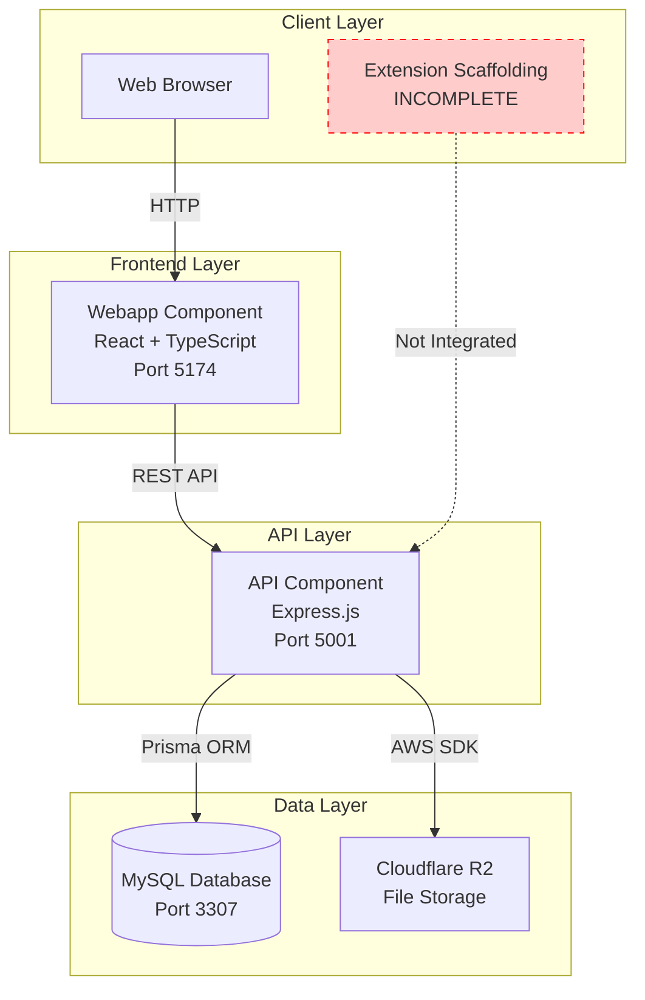

# FastGrade System Architecture Overview

**Document Type**: Authoritative Architecture Reference
**Status**: Baseline (as-implemented)
**Last Updated**: 2025-12-26

---

## Purpose

This document provides the authoritative high-level architecture reference for the FastGrade system as it exists today. This is a **baseline document** capturing the actual implemented architecture, including inconsistencies and incomplete features.

---

## System Context

FastGrade is a teacher grading efficiency tool that enables educators to create, organize, and reuse feedback comments during student assessment. The system provides comment management, file attachments, and user settings across a web application with a planned (but incomplete) browser extension.

---

## High-Level Architecture

### Architecture Style

**Modular Monolith** deployed as containerized services

- Three separate deployable components (API, Webapp, Extension)
- Shared database (MySQL)
- Shared file storage (Cloudflare R2)
- Communication via HTTP REST API
- No service mesh or API gateway

### Deployment Model

```
┌─────────────────────────────────────────────────────────┐
│                 Docker Compose Stack                    │
│                                                         │
│  ┌─────────────┐  ┌──────────────┐  ┌──────────────┐  │
│  │   Webapp    │  │     API      │  │    MySQL     │  │
│  │  (React)    │──│  (Express)   │──│  (Database)  │  │
│  │  Port 5174  │  │  Port 5001   │  │  Port 3307   │  │
│  └─────────────┘  └──────────────┘  └──────────────┘  │
│                          │                             │
│                          │                             │
│                   ┌──────▼───────┐                     │
│                   │ Cloudflare R2│                     │
│                   │ (File Storage│                     │
│                   └──────────────┘                     │
└─────────────────────────────────────────────────────────┘

Extension (Not Deployed): Browser extension scaffolding exists but
API integration is incomplete
```

**Container Orchestration**: Docker Compose (docker-compose.yml)

**Service Dependencies**:
- Webapp depends on API
- API depends on MySQL
- All services start automatically via docker-compose

**Port Mappings**:
- MySQL: 3307 (host) → 3306 (container)
- API: 5001 (host) → 5000 (container)
- Webapp: 5174 (host) → 5173 (container)

**Naming Inconsistency**: Containers named "quicknote-*" but project folder is "FastGrade"

---

## Component Diagram



---

## Technology Stack

### API Component

**Runtime**: Node.js 20
**Framework**: Express.js 4.19
**Language**: JavaScript (ES Modules)
**ORM**: Prisma 5.18
**Database Client**: @prisma/client

**Key Libraries**:
- `cors` - Cross-origin resource sharing
- `helmet` - Security headers
- `multer` - File upload handling (memory storage)
- `sharp` - Image thumbnail generation
- `@aws-sdk/client-s3` - R2 file uploads
- `pino` - Structured logging
- `zod` - Schema validation (installed but not used)

**Test Framework**: Vitest 4.0
**Dev Tools**: nodemon (hot reload)

### Webapp Component

**Runtime**: Browser (Vite dev server)
**Framework**: React 18.2
**Language**: TypeScript 5.0
**Build Tool**: Vite 4.4
**Styling**: Tailwind CSS 3.3

**Key Libraries**:
- `react-router-dom` - Client-side routing
- `@tanstack/react-query` - Server state management
- `axios` - HTTP client
- `@dnd-kit/*` - Drag-and-drop functionality
- `sonner` - Toast notifications
- `react-icons` - Icon library
- `firebase` - Authentication (unused, hardcoded auth instead)

**State Management**:
- React Context (AuthContext)
- React Query (server state caching)
- Local component state

### Extension Component

**Runtime**: Browser extension environment
**Framework**: React 19.1 (newer version than webapp)
**Language**: TypeScript 5.8
**Build Tool**: Vite 7.0
**State**: Zustand 5.0

**Status**: Scaffolding only, API integration incomplete
**Evidence**: /extension/src/utils/api.ts is empty (0 lines)

### Database

**System**: MySQL 8
**Schema Management**: Prisma migrations
**Migration Strategy**: `prisma db push` (schema sync, not versioned migrations)

**Database Name**: quicknote (inconsistent with project name "FastGrade")

### File Storage

**Provider**: Cloudflare R2 (S3-compatible)
**Access**: AWS SDK S3 Client
**Upload Strategy**: Direct upload from API (no pre-signed URLs)
**Cleanup**: None (orphaned files remain after record deletion)

---

## Module Inventory

### API Modules

| Module | Responsibility | Files | Status |
|--------|---------------|-------|--------|
| **Routes** | HTTP endpoint definitions | 9 files | ACTIVE (2 commented out) |
| **Controllers** | Request/response handling | 8 files | ACTIVE (2 empty) |
| **Services** | Business logic & data access | 10 files | ACTIVE (2 empty) |
| **Middleware** | Request processing pipeline | 4 files | ACTIVE |
| **Utils** | Shared utilities | 7 files | ACTIVE |
| **Config** | Configuration files | 1 file | ACTIVE |
| **Tests** | Unit tests | 1 file | MINIMAL |

**Total Source Files**: ~30 JavaScript files
**Lines of Code**: ~1,233 lines (excluding node_modules)

### Webapp Modules

| Module | Responsibility | Files | Status |
|--------|---------------|-------|--------|
| **Pages** | Route components | 9 files | ACTIVE |
| **Components/Features** | Feature-specific UI | 20+ files | ACTIVE |
| **Components/Common** | Reusable UI components | 10+ files | ACTIVE |
| **Hooks** | React Query hooks | 4 files | ACTIVE |
| **Services** | API client wrappers | 4 files | ACTIVE |
| **Contexts** | React Context providers | 1 file | ACTIVE |
| **Types** | TypeScript definitions | 4 files | ACTIVE |
| **Utils** | Shared utilities | 1 file | ACTIVE |

**Total Source Files**: ~50+ TypeScript/TSX files

### Extension Modules

| Module | Responsibility | Files | Status |
|--------|---------------|-------|--------|
| **Popup** | Extension popup UI | 1 file | SCAFFOLDING |
| **Sidebar** | Extension sidebar UI | 1 file | SCAFFOLDING |
| **Background** | Background script | 1 file | SCAFFOLDING |
| **Content** | Content script | 1 file | SCAFFOLDING |
| **Components** | UI components | 1 file | SCAFFOLDING |
| **Stores** | Zustand state | 1 file | SCAFFOLDING |
| **Hooks** | React hooks | 1 file | SCAFFOLDING |
| **Utils** | Utilities | 2 files | INCOMPLETE (api.ts empty) |

**Status**: Extension structure exists but API integration incomplete

---

## Data Flow

### Comment Creation Flow (End-to-End)

```
User Action (Browser)
    ↓
React Component (CreateCommentModal.tsx)
    ↓
React Hook (useCreateComment from useComment.ts)
    ↓
Service Layer (commentService.ts - axios wrapper)
    ↓
HTTP POST /api/comment
    ↓
API Router (/api/src/routes/comment.js)
    ↓
Controller (commentController.js - validation)
    ↓
Service (commentService.js - business logic)
    ↓
Prisma Client (ORM)
    ↓
MySQL Database
    ↓
Response (201 Created with data)
    ↓
React Query Cache Invalidation
    ↓
UI Re-render with new data
```

### File Upload Flow

```
User Selects File (Browser)
    ↓
Upload Component (UploadAttachmentModal.tsx)
    ↓
FormData with file binary
    ↓
HTTP POST /api/attachment/:userId (multipart/form-data)
    ↓
Multer Middleware (memory storage, file in req.file.buffer)
    ↓
Attachment Controller (attachmentController.js)
    ↓
1. Upload to R2 via uploadToR2(buffer, filename, mimetype)
    ↓
2. IF image: Generate thumbnail synchronously via Sharp
    ↓
3. Upload thumbnail to R2 with 'thumb-' prefix
    ↓
4. Create database record with both URLs
    ↓
Response (201 Created with URLs)
    ↓
React Query refetch
    ↓
Attachment grid displays new file
```

**Critical Path**: Thumbnail generation blocks response (synchronous)

---

## Communication Patterns

### Frontend ↔ Backend

**Protocol**: HTTP REST
**Format**: JSON (except file uploads: multipart/form-data)
**Base URL**: http://localhost:5001/api (configurable via VITE_API_URL)
**Authentication**: None (hardcoded user in frontend)
**Error Handling**: Axios interceptors (not implemented, default behavior)

**Request Pattern**:
```typescript
// Webapp service layer
api.post('/comment', data) → axios.create({ baseURL: VITE_API_URL })
    → HTTP POST http://localhost:5001/api/comment
```

**Response Envelope** (standard):
```json
{
  "success": true,
  "message": "Operation description",
  "data": { /* payload */ },
  "timestamp": "ISO date string"
}
```

**Inconsistencies**:
- Health endpoint returns `{ ok: true }` (non-standard)
- Tag endpoints return raw JSON (no envelope)
- Settings endpoints return raw JSON (no envelope)
- Attachment errors return `{ error: "..." }` (non-standard)

### Backend ↔ Database

**ORM**: Prisma Client
**Query Pattern**: Service layer calls Prisma methods directly
**Connection Pooling**: Default Prisma connection pool
**Logging**: Prisma queries logged via custom event handlers (prismaLogger.js)

**Example**:
```javascript
// Service layer
prisma.comment.findMany({ where: { userId }, orderBy: { createdAt: 'desc' } })
```

### Backend ↔ File Storage

**SDK**: @aws-sdk/client-s3
**Pattern**: Direct upload from API server (no client-side pre-signed URLs)
**File Handling**: Files kept in memory (multer memory storage), never written to disk
**Cleanup**: None (files orphaned after record deletion)

---

## Architectural Patterns

### API Layer Patterns

**Layered Architecture** (Routes → Controllers → Services → Database):

```
┌──────────────────────────────────────────────┐
│  Routes Layer (comment.js)                   │
│  - HTTP method mapping                       │
│  - Path definitions                          │
│  - Router composition                        │
└──────────────┬───────────────────────────────┘
               │
┌──────────────▼───────────────────────────────┐
│  Controllers Layer (commentController.js)    │
│  - Request validation (manual if/else)       │
│  - Response formatting (returnSuccess)       │
│  - Error handling (try/catch)                │
└──────────────┬───────────────────────────────┘
               │
┌──────────────▼───────────────────────────────┐
│  Services Layer (commentService.js)          │
│  - Business logic                            │
│  - Prisma queries                            │
│  - Data transformation                       │
└──────────────┬───────────────────────────────┘
               │
┌──────────────▼───────────────────────────────┐
│  Prisma Client (ORM)                         │
│  - SQL generation                            │
│  - Type safety                               │
│  - Connection management                     │
└──────────────┬───────────────────────────────┘
               │
┌──────────────▼───────────────────────────────┐
│  MySQL Database                              │
└──────────────────────────────────────────────┘
```

**Middleware Pipeline** (app.js):
1. httpLogger (pino-http) - Request/response logging
2. helmet - Security headers
3. cors - CORS handling
4. express.json - Body parsing
5. apiRoutes - Application routes
6. errorHandler - Catch-all error handling

**Validation Pattern**: Manual validation in controllers (no schema library used despite Zod being installed)

**Error Handling Pattern**:
- Controllers use try/catch blocks
- Errors formatted via returnError middleware helpers
- Unhandled errors caught by errorHandler middleware
- Generic messages sent to client, details logged server-side

### Frontend Patterns

**Component Architecture**: Feature-based organization

```
/components
  /common          - Reusable UI components
    /layout        - Page structure (Header, Button, etc.)
    /auth          - Auth-related (ProtectedRoute)
  /features        - Feature-specific components
    /comments      - Comment CRUD components
    /categories    - Category management
    /attachments   - File upload/display
    /dashboard     - Dashboard widgets
    /feedback      - Feedback forms
```

**State Management**:
- **Server State**: React Query (caching, invalidation, refetching)
- **Auth State**: React Context (AuthContext.tsx)
- **Local State**: React useState/useReducer in components
- **Form State**: Uncontrolled forms (no form library)

**Data Fetching Pattern**:
```
Page Component
    ↓
Custom Hook (useComments)
    ↓
React Query (useQuery)
    ↓
Service Layer (commentService.ts)
    ↓
Axios HTTP Client
    ↓
API
```

**Routing**: React Router v6 with ProtectedRoute wrapper

**Styling**: Tailwind CSS utility classes (no CSS modules or styled-components)

### Extension Patterns

**Architecture**: Content script + sidebar (planned)
**State**: Zustand store (commentStore.ts)
**Status**: Incomplete - no API integration implemented

---

## Module Dependencies

### API Module Dependencies

**Routes** depend on:
- Controllers (import controller functions)
- Express Router

**Controllers** depend on:
- Services (business logic)
- Middleware helpers (returnSuccess, returnError)

**Services** depend on:
- Prisma client (utils/prisma.js)
- No cross-service dependencies (isolated)

**Utils** depend on:
- External libraries only (no internal dependencies)

**Dependency Direction**: Unidirectional (Routes → Controllers → Services → Prisma)

**Violations**: None found (clean layering)

### Webapp Module Dependencies

**Pages** depend on:
- Feature components
- Common components
- Custom hooks
- Contexts

**Hooks** depend on:
- Services (API clients)
- React Query

**Services** depend on:
- Utils (axios instance)
- Types (TypeScript interfaces)

**Components** depend on:
- Hooks (data fetching)
- Services (direct calls in some cases)
- Other components (composition)

**Dependency Direction**: Mostly unidirectional with some circular dependencies between components and hooks

---

## Infrastructure Architecture

### Container Configuration

**docker-compose.yml** defines three services:

```yaml
services:
  mysql:
    image: mysql:8
    container_name: quicknote-mysql
    ports: ["3307:3306"]
    environment:
      MYSQL_DATABASE: quicknote
      MYSQL_ROOT_PASSWORD: root

  api:
    build: ./api
    container_name: quicknote-api
    ports: ["5001:5000"]
    depends_on: [mysql]
    volumes:
      - ./api:/app          # Live code reload
      - /app/node_modules   # Isolated deps
    command: npm run dev

  webapp:
    build: ./webapp
    container_name: quicknote-webapp
    ports: ["5174:5173"]
    depends_on: [api]
    volumes:
      - ./webapp:/app       # Live code reload
      - /app/node_modules   # Isolated deps
    command: npm run dev
```

**Volume Strategy**:
- Source code mounted for live reload during development
- node_modules isolated inside containers
- MySQL data persisted via named volume (mysql_data)

**Networking**: Default bridge network (services communicate via service names)

### Build Configuration

**API Dockerfile**:
- Base: node:20
- Prisma generate during build
- Installs dependencies with npm ci/install
- Exposes port 5000
- Runs nodemon for dev mode

**Webapp Build**:
- Base: node:20 (implied from package.json)
- Vite dev server on port 5173
- TypeScript compilation via tsc
- Hot module replacement enabled

**No Production Builds**: Only development configuration present

---

## Deployment Architecture

**Current State**: Development-only deployment via Docker Compose

**Environment Variables**:
- `DATABASE_URL` - MySQL connection string (defined in docker-compose)
- `VITE_API_URL` - API base URL for webapp (defined in docker-compose)
- `NODE_ENV` - Set to "development"
- R2 credentials - Required but defined outside docker-compose (likely in .env)

**Missing Production Concerns**:
- No production Dockerfiles
- No health checks defined
- No resource limits (CPU/memory)
- No restart policies beyond "always" for MySQL
- No logging aggregation
- No monitoring/metrics
- No secrets management (credentials in plaintext)
- No HTTPS/TLS configuration

---

## Architectural Debt & Inconsistencies

### Naming Inconsistencies

- **Project folder**: FastGrade
- **Docker containers**: quicknote-*
- **Database name**: quicknote
- **Package names**: webapp, quicknote-api
- **Spelling**: isFavourite (UK) vs favorite (US) used inconsistently

### Incomplete Features

1. **Browser Extension**: Scaffolding exists but API integration incomplete (api.ts is empty)
2. **Tag System**: API endpoints exist but CommentTag associations never created (TODO in code)
3. **HotkeyMapping**: Database table exists but no API endpoints
4. **Authentication**: Hardcoded in frontend, no backend validation
5. **Settings Page**: Empty placeholder in webapp

### Architectural Gaps

1. **No Authentication Layer**: API trusts client-provided userId with no verification
2. **No Authorization**: No ownership checks beyond client-provided userId
3. **No API Versioning**: Routes have no /v1/ prefix
4. **No Rate Limiting**: Unlimited requests per client
5. **No Caching**: No cache-control headers or response caching
6. **No Pagination**: All queries return full result sets
7. **Synchronous File Processing**: Thumbnail generation blocks upload response
8. **No Cleanup Strategy**: R2 files orphaned after record deletion

### Mixed Patterns

1. **Response Envelopes**: Some endpoints use standard format, others return raw JSON
2. **Validation**: Manual if/else checks in controllers despite Zod being installed
3. **Error Formats**: Inconsistent error response structures
4. **Component Organization**: Features vs common division not consistently applied
5. **Service Layer**: Some direct Prisma calls in controllers, bypassing service layer

### Missing Infrastructure

1. **No Migration History**: Uses `prisma db push` instead of versioned migrations
2. **No Test Coverage**: Only 1 test file found in API
3. **No CI/CD**: No GitHub Actions or deployment automation
4. **No Monitoring**: Console logging only, no metrics or APM
5. **No Backup Strategy**: Database backup not documented or automated
6. **No Secrets Management**: Credentials likely in .env files (not version controlled)

---

## Scalability Constraints

### Current Limitations

1. **Single Database Instance**: No read replicas or sharding
2. **In-Memory File Processing**: multer memory storage limits file size
3. **Synchronous Processing**: Thumbnail generation is blocking
4. **No Background Jobs**: All processing happens in request/response cycle
5. **No Query Optimization**: Missing indexes on frequently queried fields
6. **No Connection Pooling Config**: Using Prisma defaults

### Horizontal Scaling Blockers

1. **Stateful Sessions**: Not applicable (no auth)
2. **File Upload**: Direct upload to R2 from API (no distributed storage consideration)
3. **Database**: Single MySQL instance (no clustering or replication)

---

## Security Architecture

**Current State**: Minimal security implementation

**Implemented**:
- Helmet middleware (security headers)
- CORS enabled
- Prisma parameterization (SQL injection protection)
- JSON body parsing with size limits (default Express)

**Missing**:
- Authentication middleware
- Authorization checks
- Input sanitization (XSS protection beyond Helmet headers)
- CSRF protection
- Rate limiting
- File upload validation (type whitelist, size limits, virus scanning)
- Secrets rotation
- Database encryption at rest
- TLS/HTTPS termination

**Threat Model**: Not documented

---

## Observability

### Logging

**API Logging**:
- Library: Pino (structured JSON logging)
- HTTP Logging: pino-http middleware
- Prisma Logging: Custom event handlers (prismaLogger.js)
- Log Levels: info, warn, error
- Output: Console (no file rotation or aggregation)
- Log Location: /api/logs (mounted volume)

**Frontend Logging**: Browser console only (no client-side logging service)

### Monitoring

**Current State**: None implemented

**No Metrics**:
- Request rates
- Error rates
- Database query performance
- Cache hit rates
- File upload success rates

**No Alerting**: No monitoring system to trigger alerts

### Debugging

**Development Tools**:
- React Query Devtools (webapp)
- Browser DevTools
- Nodemon (API hot reload)
- Vite HMR (webapp hot reload)

**Production Debugging**: Not configured (no production deployment)

---

## Testing Architecture

**API Tests**:
- Framework: Vitest
- Coverage: Minimal (1 test file found)
- Location: /api/src/__tests__/
- Test Type: Unit tests for services

**Webapp Tests**: None found (no test files)

**Extension Tests**: None found

**Integration Tests**: None found

**E2E Tests**: None found

**Test Strategy**: Not documented

---

## Build & Deployment

### Development Workflow

1. Developer runs `docker-compose up`
2. Services start with live code reload:
   - API: nodemon watches /api/src
   - Webapp: Vite HMR watches /webapp/src
3. Database schema changes: Manual `prisma db push` inside container
4. Changes reflected immediately (no rebuild required)

### Production Deployment

**Status**: Not configured

**No Production Artifacts**:
- No production Dockerfiles
- No build optimization
- No static asset serving strategy
- No CDN configuration
- No load balancer setup

---

## Document Maintenance

**Update Trigger**: This document should be updated when:
- New major components are added (e.g., new microservice)
- Technology stack changes (e.g., database migration)
- Deployment architecture changes (e.g., Kubernetes adoption)
- Major architectural patterns change (e.g., event-driven architecture)

**Not Updated For**:
- New API endpoints (document in OpenAPI spec)
- New UI components (code is source of truth)
- Bug fixes or minor refactors

**Ownership**: Staff Engineer + Tech Lead

---

## Cross-References

- **API Baseline**: /ai/features/system-baseline/04-api-baseline.md
- **Data Model Baseline**: /ai/features/system-baseline/05-data-baseline.md
- **OpenAPI Specification**: /ai/artifacts/openapi/openapi.yaml
- **ERD Diagram**: /ai/artifacts/data-model/erd.mmd
- **Architecture Standards**: /ai/artifacts/standards/architecture.md

---

## Revision History

| Date | Version | Changes | Author |
|------|---------|---------|--------|
| 2025-12-26 | 1.0 | Initial architecture baseline | Staff Engineer Reviewer |

---

**End of Document**
